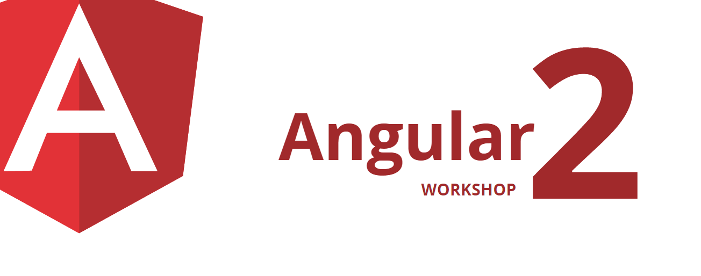

# Angular 2 Workshop - Setup (Aktualisierung)

Ihre Trainer: [Johannes Hoppe](http://haushoppe-its.de/), [Gregor Woiwode](http://www.woiwode.info/)

<hr>


Liebe Teilnehmer,  
wir möchten euch unbedingt darauf hinweisen, dass die Installation unbedingt rechtzeitig geschehen muss. Am Veranstaltungsort ist die Bandbreite stark eingeschränkt. Wenn Ihr die __angular-cli@1.0.0-beta.20-4__ schon installiert habt, braucht Ihr nicht zwingend updaten. Es handelt sich hauptsächlich im Bugfixes und um ein kleines Versions-Upgrade von Angular.

Beste Grüße  
Johannes & Gregor


## Benötigte Software

1. Node.js **6.5** oder höher - https://nodejs.org/
2. Visual Studio Code **1.7** oder höher - https://code.visualstudio.com/
3. Google Chrome - https://www.google.com/chrome/
4. empfohlen : Git und/oder GitExtensions - https://gitextensions.github.io/


## Pakete installieren

Alle Teilnehmer mit dem Betriebssystem Windows sollten vor Beginn des Kurses die `windows-build-tools` installieren.  
Nach der Installation müssen Sie eine neue Konsole starten!

```
npm install -g windows-build-tools
```

Folgender Befehl muss von allen Teilnehmern vor Beginn des Kurses ausgeführt haben:

```
npm install -g angular-cli@1.0.0-beta.22-1 typescript@2.0.10 webpack@2.1.0-beta.25
```

... bitte anschließend die Versionen überprüfen:

```
node -v
> Erwartet: v6.x

npm -v
> Erwartet: 3.x

tsc -v
> Erwartet: 2.0.10

ng -v
> Erwartet: 1.0.0-beta.22-1

webpack -h
> Erwartet: 2.1.0-beta.25

```

Tipp:  
Sollte eine falsche Version von TypeScript erscheinen, so haben Sie vermutlich in der Vergangenheit (über Visual Studio) eine ältere Version bezogen.
Lokalisieren Sie den Installationsort per `where tsc` und entfernen Sie diesen Ordner aus der Windows-Umgebungsvariable `%PATH%`. 

## OPTION A) Startprojekt erzeugen

Bitte legen Sie das Übungsprojekt vor Beginn des Workshops an.  
Wechseln Sie dazu in Ihr Arbeitsverzeichnis und führen Sie aus:

```
ng new book-rating
cd book-rating
npm start
```

Achtung! Die Installation kann sehr lange dauern.
Warten Sie beim Schritt `Installing packages for tooling via npm.` mit Geduld ab.


> Auf http://localhost:4200 sollte nun eine Website mit dem Text "app works!" erscheinen!
Wenn bei allen Teilnehmern "app works!" erscheint, können wir ohne Zeitverlust los legen.


## OPTION B) Startprojekt clonen

Wenn Sie möchten, so können Sie auch unser Demo-Repository clonen:

```
git clone https://github.com/angular-buch/angular2-workshop-netdc16.git .
cd angular2-workshop-netdc16
cd book-rating
npm install
npm start

```

Achtung! Die Installation kann sehr lange dauern.


> Auf http://localhost:4200 sollte nun eine Website mit dem Text "app works!" erscheinen!
Wenn bei allen Teilnehmern "app works!" erscheint, können wir ohne Zeitverlust los legen.


## VSCode erweitern

Häufig werden wir gefragt, welche Visual Studio Code Erweiterungen wir verwenden.
Folgende (optionalen) Erweiterungen sorgen für mehr Komfort.

* [Auto Import](https://marketplace.visualstudio.com/items?itemName=steoates.autoimport) 
* [EditorConfig for VS Code](https://marketplace.visualstudio.com/items?itemName=EditorConfig.EditorConfig)
* [TSLint](https://marketplace.visualstudio.com/items?itemName=eg2.tslint)
* [language-vscode-javascript-angular2](https://marketplace.visualstudio.com/items?itemName=nwallace.language-vscode-javascript-angular2)
* [vscode-icons](https://marketplace.visualstudio.com/items?itemName=robertohuertasm.vscode-icons)

Alle Erweiterungen lassen sich mit folgenden Befehlen installieren:

```
code --install-extension steoates.autoimport 
code --install-extension EditorConfig.EditorConfig 
code --install-extension eg2.tslint 
code --install-extension nwallace.language-vscode-javascript-angular2 
code --install-extension robertohuertasm.vscode-icons
```


###Wir freuen uns auf einen tollen Workshop!

-----


Stand: 06.12.2016